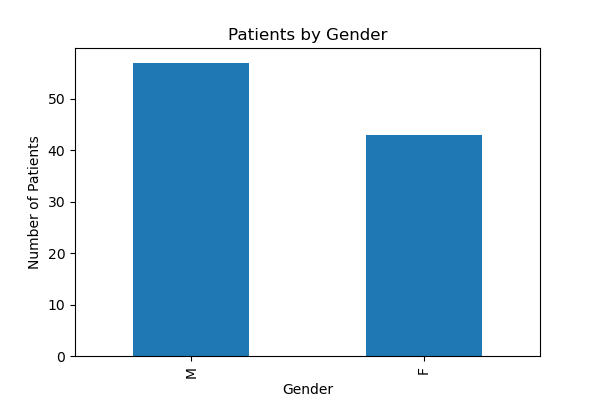
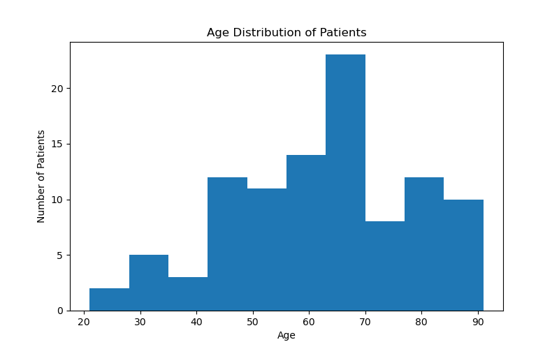
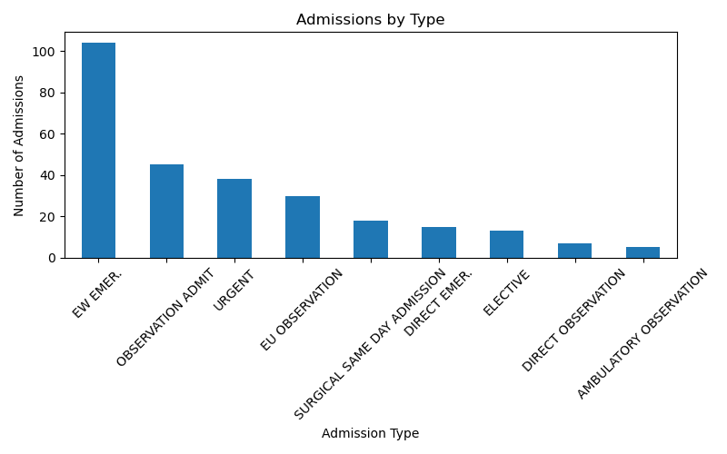
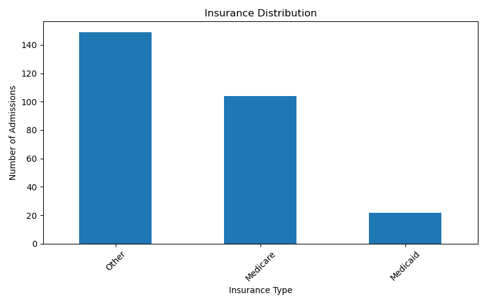
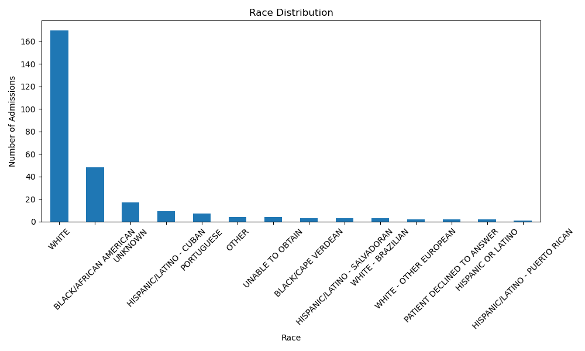
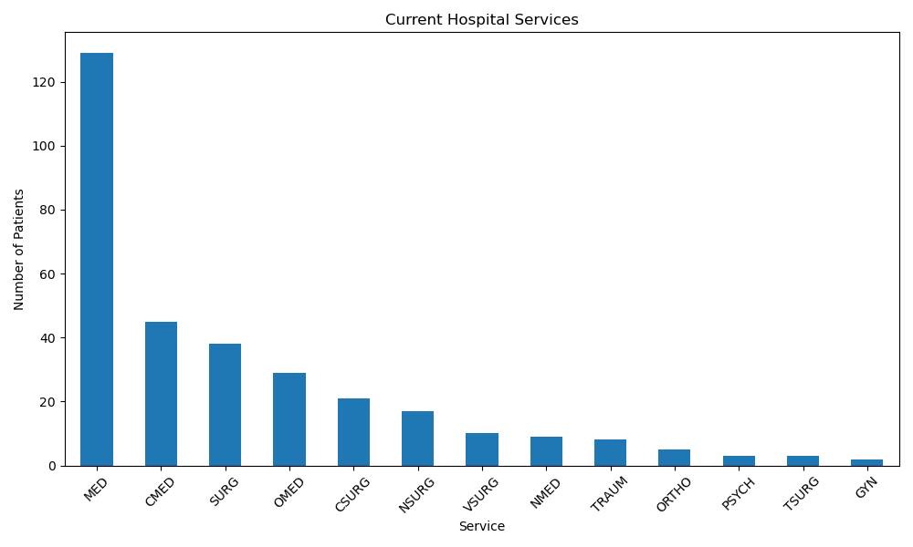
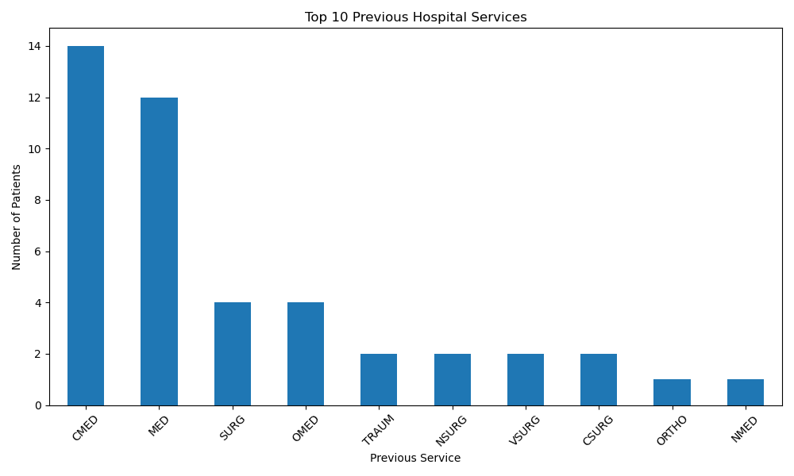
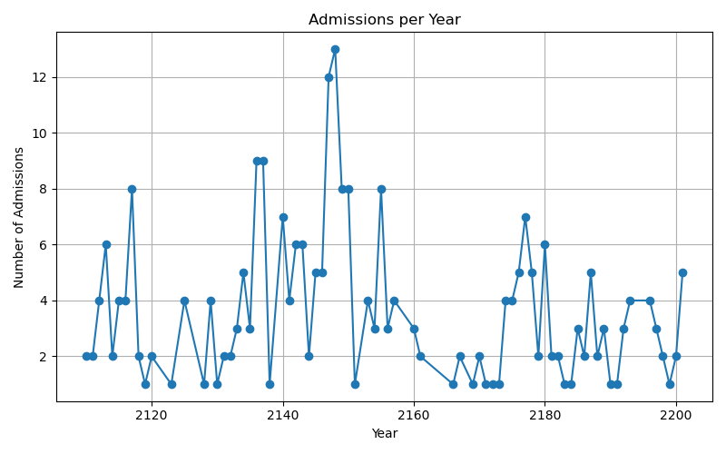

# Hospital Performance Analytics

A data analysis project using Python, SQL, SQLite, Pandas and Matplotlib to explore hospital patient, admission and service data from the MIMIC-IV Demo dataset.

## Project Objectives

The purpose of this project is to:

- Analyze patient demographics
- Explore hospital admission patterns
- Examine insurance and race distributions
- Analyze current and previous hospital services
- Visualize key hospital performance indicators

## Technologies Used

- Python
- SQL
- SQLite
- Pandas
- Matplotlib
- DB Browser for SQLite
- Git and GitHub

## Project Structure

```text
Hospital-Performance-Analytics/
│
├── data/
│   ├── patients.csv
│   ├── admissions.csv
│   ├── services.csv
│   └── Hospital-Performance-Analytics_hospital.db
│
├── images/
│   └── charts/
│
├── notebooks/
│   └── analysis.ipynb
│
├── sql/
│   └── queries.sql
│
├── src/
│   ├── analysis.py
│   ├── import_data.py
│   └── visualization.py
│
├── .gitignore
├── README.md
└── requirements.txt
```
## Analysis Performed

The SQL analysis includes:

- Patient and admission counts
- Admission type analysis
- Insurance analysis
- Patient demographic analysis
- Hospital service analysis
- JOIN operations between patients, admissions and services

The Python analysis includes:

- Summary statistics
- Gender distribution
- Patient age distribution
- Admission type distribution
- Insurance distribution
- Race distribution
- Current hospital services
- Previous hospital services
- Admissions per year

## Visualizations

### Patients by Gender



### Patient Age Distribution



### Admissions by Type



### Insurance Distribution



### Race Distribution



### Current Hospital Services



### Top Previous Hospital Services



### Admissions per Year



## Requirements

- Python 3.10+
- SQLite
- Pandas
- Matplotlib


## How to Run the Project

Install the required libraries:
```bash
pip install -r requirements.txt
```
Run the analysis:
```bash
python src/analysis.py
```

## Dataset

This project uses the MIMIC-IV Demo dataset, a publicly available de-identified hospital database for education and research purposes.

## Author

Fanis Gkasdranis